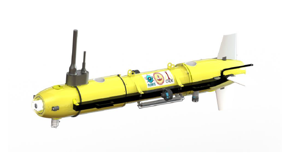
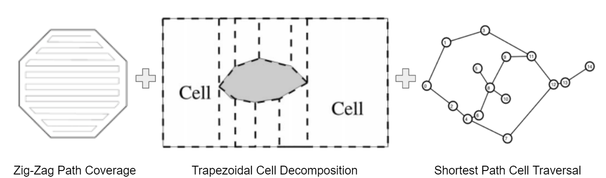

# Path Planning

This folder contains the codes used in solving the problem of Path planning for an AUV bathymetric survey for Planys Technologies.

AUV Specification

Dimensions:
* Length = 2.23m
* Diameter = 0.68m

DOFs utilization:
* Surge (2 thrusters)
* Heave (2 thrusters)
* Yaw
* Pitch

Problem Statement:
 
Efficient path planning of an AUV to perform the bathymetric survey in Kasimedu Harbour, Chennai.

Our Strategy:

**Zig-Zag Path Coverage (Lawn Mover)**:
 
&nbsp;&nbsp;&nbsp;&nbsp;&nbsp;
This method is used to traverse unknown areas shaped as convex polygons. The terrain acquisition is sensor-based and follows a rectilinear zig-zag path. In our interim result, we have achieved more than 80% coverage in the given areas using purely the lawn mover algorithm. After the interim results, we implemented an capped adaptive resolution algorithm to traverse the regions with a smaller width.

Implementation (inspired by Atsushi Sakai’s GitHub repository)
 
1. It uses a list of vertex coordinates which are used to construct the edges of the area which are treated as obstacles.
2. A direction is specified from an internal start point to traverse a given area.
3. The AUV moves in a rectilinear fashion along the specified path direction and takes a u-turn on facing an obstacle. The radius of the u-turn is specified by the resolution. This u-turn takes the direction of the open space.

**Trapezoidal Cell Decomposition:**
 
&nbsp;&nbsp;&nbsp;&nbsp;&nbsp;
The given area is divided into guaranteed multiple convex polygon cells shaped as trapezia and triangles. Trapezoidal is the most basic and reliable method for cell decomposition and gives a higher percentage of coverage area as compared to the other methods(Morse Cell Decomposition, Boustrophedon decomposition, Sensor Coverage Decomposition, Brushfire Decomposition, and Wavefront Decomposition) for highly irregular non-convex polygon areas.[Choset, 2001]

Implementation:
 
1. Input given is a coordinates list of the area boundary points.
2. Sort the vertices from left to right in relation to the longest edge.
3. Calculation of the edges between pairs of vertices.
4. Sweep a vertical line through the given area stopping at each vertex to form a cell splitting event.
Maintain a list of polygonal vertex point coordinates for individual cells.
5. Join the midpoints of the trapezia or the vertices of triangles in order to create vertical cell divisions.
6. Maintain a list of polygonal vertex point coordinates for individual cells.
7. Develop an adjacency graph for the individual cells where the node corresponds to a cell and an edge connects nodes of cells sharing common boundaries.

**Shortest Path Cell Traversal:**
 
&nbsp;&nbsp;&nbsp;&nbsp;&nbsp;
We use a generalized form of the popular traveling salesman problem [Dantzig, Ramser, Hubert, 1959]. The solution is a combinatorial algorithm that uses mixed-integer programming as a minimization strategy.

Implementation:
 
1. Consider the adjacency graph of the cells and weighted edges, where the weights represent the distances between individual cell centers. 
2. The algorithm then compares the distance weights for each potential path and recursively computes the minima for the adjacent subsets in the graph. There are at most n*2n subproblems for each cell in an n element graph.

**Execution Instructions** 
 
Run the code final.py to get the cell decomposition plot of given area and run the code cell_traversal.py to get the cell traversal sequence.
Press "q" to close the plot.
 
After the plot is closed, grid based sweep algorithm calculates the grid pattern for each cell in an order and shows the plot with the grid.
